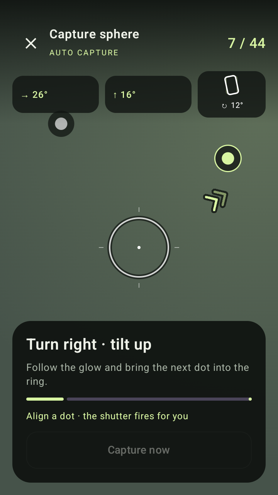
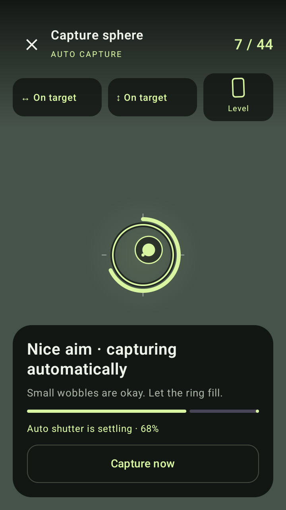
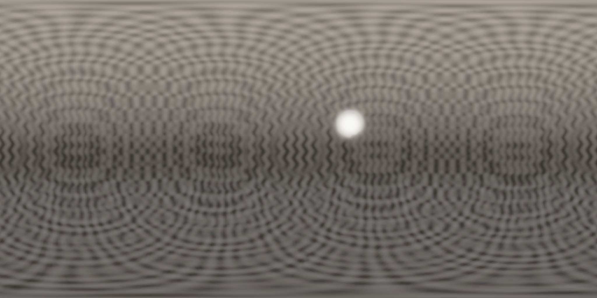

# Handheld capture and guidance update

Latest implementation and release evidence: [sky capture with inertial guidance and fewer stops](SKY-CAPTURE.md).

The Pixel 8 report identified an unusably strict automatic shutter. Two separate checks contributed: differentiating successive AR poses amplified small tracking changes, and integrating the magnitude of every gyro sample accumulated ordinary tremor and included JPEG saving time.

## Automatic capture remains the default

- Aim enters the capture window at 4.5° and remains inside until 6°, preventing repeated resets near an edge.
- A 300 ms orientation envelope accepts up to 2.2° of movement. After an initial 100 ms observation, 450 ms of steady credit fills the shutter ring. A brief wobble reduces progress gradually. Clear misalignment, lost tracking, large translation, or a frame gap above 250 ms resets it.
- Initial framing can move freely. The pivot is fixed at the first actual capture. Translation above 18 cm is advisory; above 45 cm pauses capture and gives screen-relative return instructions. These are practical initial tolerances, not a guarantee that parallax can be corrected.
- New capture plans add overlap to accommodate the expanded aim window. Saved plans and source photos remain usable.
- **Capture now** is secondary and only enabled with tracking and sufficient alignment. It does not replace automatic capture. Phone roll is never an absolute alignment requirement.

Gyro samples run on a separate thread from Camera2/JPEG writes. Signed quaternion integration measures rotational excursion instead of summing every back-and-forth movement. On cameras advertising a shared realtime clock, checks use sensor exposure timestamps, exposure duration and rolling-shutter skew. Excursions above 6° across a bracket or 2.5° within an exposure trigger an inline automatic retry. Smaller detectable movement is retained as a persisted quality finding. Missing/incomparable sensor timestamps produce a review finding, not an arbitrary rejection based on file-save latency.

Relevant platform contracts: [Android motion sensors](https://developer.android.com/develop/sensors-and-location/sensors/sensors_motion), [camera timestamp source](https://developer.android.com/reference/android/hardware/camera2/CameraCharacteristics#SENSOR_INFO_TIMESTAMP_SOURCE), and [rolling-shutter skew](https://developer.android.com/reference/android/hardware/camera2/CaptureResult#SENSOR_ROLLING_SHUTTER_SKEW).

## Guidance

The live camera keeps the next target visible with a breathing directional vignette and double chevrons. Separate turn and tilt cues show the remaining angle. A small phone outline shows optional roll correction and stops requesting leveling near the poles. The aim ring fills automatically; progress, saved-direction feedback and large-motion retries are visible in the capture view.

## The sample's dark horizontal zone

The old analytic sample abruptly enabled its floor illumination at world `y = -0.35`, about latitude −20.5°. In the retained 2048 × 1024 preview, the strongest horizontal brightness jump appeared around rows 626–628, matching the predicted source boundary at row 628.55. This created the hard edge below the darker horizon zone.

The source now uses a continuous smooth floor transition and a smooth sky gradient. This changes newly generated sample photos. Create a new **Explore a sample capture** session; reprocessing old photos preserves their original lighting step.

Regression tests cover handheld jitter at 15/30/60 fps, aim hysteresis, tracking loss, stale frames, deliberate sweeps, gyro oscillation versus real motion, guidance axes and polar leveling, and continuity of the synthetic light field. An independent native renderer test stitches a known smooth radiance field and measures horizontal bands, longitude closure and brightness bias. The production HUD is rendered with supplied test state so arrows, automatic progress and fallback-button behavior can be checked without pretending the emulator has Pixel 8 AR hardware.

Physical confirmation of the new shutter tolerances and a complete real Pixel 8 sphere remain necessary.

## Verified release

[Preview 7 APK](https://github.com/otdavies/android-hdri/releases/download/v0.1.0-preview.7/hdri-0.1.0-preview.apk) was built from `19b4fb012b8a6f61e6bafbf41849914245874de4` and passed [Actions run 34009178772](https://github.com/otdavies/android-hdri/actions/runs/34009178772). Sixteen JVM tests, Android lint and eight installed-APK tests passed. The device suite completed in 37.346 seconds. The published APK is the same binary installed and tested by the device job.

APK SHA-256: `2f10ff426231c37de623f41ef0ff5d07d47edcbd47e7a57d6fe2cb99775bbeee`.

| Check | Result |
| --- | --- |
| New 37-direction analytic sample coverage | 100% on the seam grid |
| Sample median relative radiance error after one global exposure scale | 14.06% |
| Sample processing time on this emulator, excluding generation | 8.417 s |
| Smooth-field maximum change in row-average relative error between adjacent rows | 0.286% |
| Smooth-field maximum longitude-edge relative difference | 0.980% |
| Smooth-field maximum row-average relative brightness bias | 1.394% |

These are synthetic fixture measurements, not physical camera or phone-performance claims. The changed sample lighting and denser capture plan make its radiance error a different fixture from the original preview. [Machine-readable results](evidence/capture-update.json) are retained. The downloaded verification ZIP was SHA-256 checked before inspection.

The following screenshots show the production HUD rendered in the emulator over a supplied plain background, with explicit test poses. They verify layout, contrast and state transitions; they do not imply an emulator AR capture. The regression also checks a diagonal offset where both individual axes appear close but the combined angle is still outside the automatic shutter's entry window.

 

Newly generated sample output, with the former hard floor boundary replaced by a continuous transition:

Independent renderer output for a smooth known radiance field:

