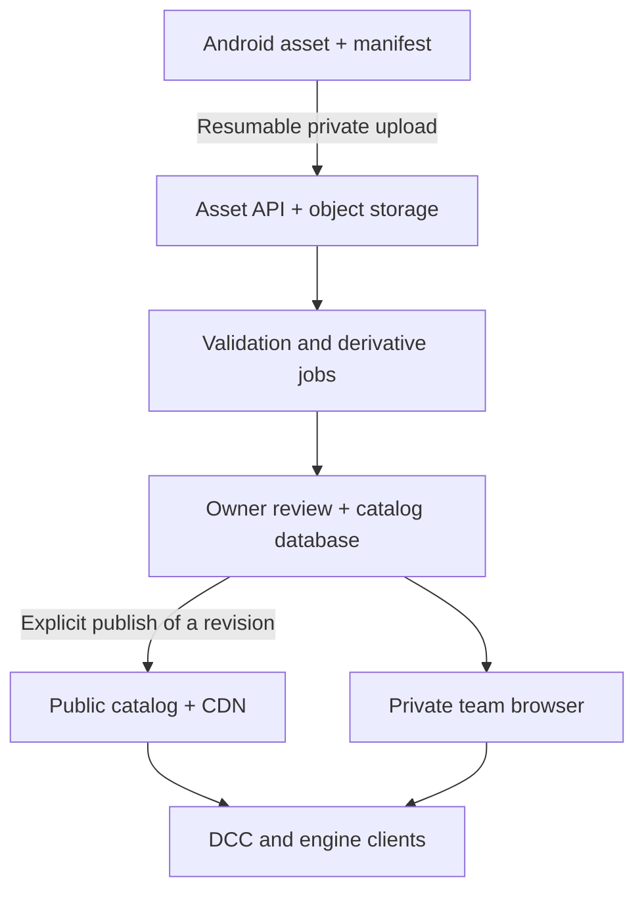

# From sphere captures to a useful HDRI library

Research and proposal · 7 September 2026. This is a staged product/engineering plan, not a claim that the current phone captures meet Poly Haven's publishing requirements. The app still works entirely locally; this change adds no account, network permission, upload or public publishing.

**Updated direction:** [the current catalog and import plan](CATALOG-MVP.md) supersedes this document's launch sequence. Start with public HDRI browsing/downloads and straightforward Blender/Unity/Unreal imports, followed by a separate tracked-placement experiment. The [service plan](SERVICE-PLAN.md) retains infrastructure/cost research; private project passes are an earlier alternative. RAW, 16K and calibrated capture remain useful research tracks, not prerequisites for publishing useful phone environments. The comparisons and measurement work below remain reference material.

## Recommendation

Start with **a personal and team lighting library for real locations**: capture on a phone, evaluate the light on chrome/grey objects, attach a scene/take reference, and deliver a predictable asset to Blender or a game engine. Build a curated public collection on top of that workflow once capture quality can be measured. The advantage to pursue is fast acquisition of the user's actual location, repeat visits and useful production context.

Poly Haven is a useful quality benchmark. Competing with its public catalog immediately would require a substantially more controlled acquisition pipeline and sustained human curation. A larger output image alone would not close that gap. Keep the current handheld mode useful while developing an optional calibrated workflow.

## What the benchmark actually requires

Poly Haven's [HDRI contribution requirements](https://polyhaven.com/contribute) specify photographic, unclipped, linear assets at a minimum 16K, with a separately bracketed color-chart reference. They exclude significant seams, avoidable flare and blur, require removal of the tripod/shadow, and review submissions. Those are their requirements, not measurements of sphere's current results.

| Area | sphere today | Next measurable improvement |
|---|---|---|
| Acquisition | Guided handheld JPEG exposure brackets; per-lens intrinsics and exposure metadata | Capability-tested RAW brackets with calibrated black level, lens shading and sensor-to-working-space color; preserve the quick mode |
| Dynamic range | Relative radiance from processed images; clipped values cannot be recovered | Per-direction shortest-exposure clipping masks and longest-exposure noise estimates; repeat only deficient directions |
| Alignment | Global pose/focal refinement, local warps, seams and multiband blending | Report overlap residual distributions and disconnected regions; show trouble areas with a recapture action |
| Color/exposure | Fixed daylight WB, requested tone-curve inversion, bounded overlap corrections | Optional bracketed chart workflow; document working primaries, white point and relative exposure convention |
| Resolution | 2K/4K output | Measure angular source sampling and resolved detail per lens before offering 8K/16K; no upscaling badge |
| Ground | Capture or approximate fill below the user | Export an edited-region mask and provenance; offer an actual clean ground patch for higher-grade assets |
| Delivery | One HDR/EXR master, JPEG, lighting viewer, source bundle | Versioned asset manifest, integrity hash, consistent previews and requested resolution variants |

The [Poly Haven acquisition guide](https://blog.polyhaven.com/how-to-create-high-quality-hdri/) uses overlapping horizontal, upward and downward rings, manual exposure controls and a linear RAW workflow. It separates display previews from radiance, and calls out motion, parallax and light-source clipping as practical failure modes. Our new horizon-first route follows the ring principle; it is a sensible acquisition heuristic, not a demonstrated increase in stitching success rate. Body movement remains expected input for sphere.

Their [clipping explanation](https://blog.polyhaven.com/what-is-clipping/) explains why a panorama can look convincing while still producing incorrect illumination: saturated light sources have lost their relative energy. A pleasing chrome-ball thumbnail must never substitute for an exposure-range check.

## Phase 1 — establish a reproducible capture-quality baseline

Build a small consented evaluation set: close interiors, an outdoor sun, overcast sky, night point sources, repeated structures, moving people/foliage and intentional normal body pivots. Pair selected scenes with a reference camera panorama and bracketed chart. Keep private location imagery out of the public code repository.

Measure separately, with units and diagnostic images:

- Seam displacement in output pixels and angular units, including the 0/360 wrap and polar neighborhoods. Review both a perspective viewer and equirectangular output; map projection itself distorts poles.
- Overlap exposure residuals in EV and color residuals on valid unsaturated static matches. Report sample counts and confidence; exclude synthetic ground and uncertain occlusions.
- Pixels saturated in every available exposure, especially bright connected components. Bracket spacing is not the same as captured dynamic range, and a single maximum/minimum ratio is not a useful accuracy score.
- Grey/chart render differences under a defined orientation, shared exposure and display transform. Separate radiometric error from the user's display exposure preference.
- Focus, bracket movement, capture duration, processing time, peak memory, heat and final retained bytes on Pixel 8; then a small representative device/lens matrix.

First experiment: collect matched repeated scans with the prior nearest-dot policy and the new canonical route. Compare capture completion, time, overlap failures and human seam review. The route intentionally does not add more stops or tighter motion thresholds.

For RAW, probe the selected camera's capabilities and actual supported stream combinations. Android's [RAW capability contract](https://developer.android.com/reference/android/hardware/camera2/CameraCharacteristics#REQUEST_AVAILABLE_CAPABILITIES_RAW) and [DngCreator](https://developer.android.com/reference/android/hardware/camera2/DngCreator) provide the underlying interfaces; a logical camera advertising RAW does not establish that every zoom-out path can deliver the desired stream. Verify main and ultrawide separately on the phone. Prototype sequential bounded processing and lossless source compression before offering this to users, because RAW can substantially increase temporary storage.

Deliverable: a versioned quality report and overlays with specific recapture advice. Keep **reference capture**, **needs review**, and **reviewed asset** distinct. Set acceptance thresholds from the reference dataset and intended use; don't invent a single unsupported quality percentage.

## Phase 2 — make a capture a portable asset

Add a small sidecar with an explicit schema version:

| Group | Fields |
|---|---|
| Identity | Asset UUID, revision, title, user notes, created time, producer app/algorithm versions |
| Radiance | Master hash/bytes, dimensions, projection, RGB primaries/white point, relative units and exposure convention |
| Capture | Device/lens calibration identifier, actual bracket metadata, date, source availability |
| Quality | Report version, measured residuals, clipping/noise estimates, review state, unresolved warnings |
| Edits | Ground-fill mode, edited-region mask reference, manual cleanup history |
| Context | Optional production/project/scene/take tags; optional coarse location supplied by the owner |
| Rights | Owner-supplied attribution and license for an explicitly shared revision; private/unlicensed by default |
| Derivatives | Chrome/grey/JPEG previews and requested export variants, each keyed to the master hash and renderer version |

The master hash identifies bytes, not perceptual equivalence. EXR-to-HDR conversion creates a different byte hash and may introduce RGBE quantization; retain a stable asset/revision identity separately.

Keep one lossless master on the phone. Generate smaller exports on demand, remove temporary conversions after delivery, and make source retention a visible choice. A thumbnail is a disposable derivative. This release implements that first small foundation: a transparent 192px chrome sphere from the actual HDR, loaded a scanline at a time and cached separately with a bounded size.

A practical next implementation would be the sidecar plus a **quality review** screen and one Blender import recipe: master + manifest + orientation/exposure controls. Validate export colors and environment orientation with known test lights. Add Unreal/Unity integrations after the file contract is stable.

## Phase 3 — private collections and optional sharing

Keep capture, stitching and export independent of a service. When optional sync is introduced, show the exact upload contents/size and visible transfer progress. Default to finished assets; sources are a separate explicit choice. Support resume, pause, cancellation, metered-network preferences and local-only projects.

Proposed minimal service:

Use a relational catalog for assets/revisions/permissions/review records; object storage for immutable masters and derivatives; a durable job queue for validation and previews. Keep private storage inaccessible through public derivative URLs. Enforce owner/team access per asset and use short-lived download authorization. Publish a reviewed immutable revision, not a mutable live capture folder.

Start search with titles/tags, indoor/outdoor, light type, sun elevation/direction, dynamic-range status and resolution. Compare assets in the same grey/chrome scene with a shared exposure control. Add semantic search only after tags and examples show what users actually seek. A map is optional and must use owner-approved location precision.

## Phase 4 — a curated public library

Publication needs a preview of every deliverable, removal of sensitive metadata, an owner-selected rights declaration, human review and a withdrawal/contact process. Production locations, recognizable people, license uncertainty and visible protected content need an explicit review workflow. Never infer permission to publish from permission to process a phone capture.

Poly Haven's [assets are CC0](https://polyhaven.com/license). Adopting that model would be a product decision requiring informed contributor agreement; do not automatically apply it to existing captures. Review terms and operational obligations before implementing a contribution flow. Its site branding and example renders are not automatically covered by the asset license.

The [Poly Haven API](https://polyhaven.com/our-api) exposes searchable asset metadata and file URLs, sizes and hashes, with HDR/EXR resolution variants and other supporting files. As checked on this research date, its page says commercial API use is free, with visible Poly Haven attribution and a unique User-Agent required for live API use. Asset licensing and service-use conditions are separate. A clearly credited reference-library integration could be useful later; it would not create a sphere-owned catalog or remove the need to curate our captures.

Before launch, estimate operations from a pilot rather than assuming image hosting is free: retained master bytes × asset revisions, derivative storage, delivered GB, job CPU time, backups and reviewer time. Preserve the phone's compact local master; server-side download variants can be generated and cached by demand. A paid private-team workflow or voluntary public-library support are hypotheses to test with users, not commitments in this release.

## Earlier proposed sequence (superseded by the service plan)

1. Implement the portable manifest and edited-region provenance, plus a focused quality-review UI using existing stitch diagnostics.
2. Build a Pixel 8 RAW/linear-response and bright-source clipping experiment; measure the main and ultrawide paths separately.
3. Validate chart-based relative lighting and a Blender import workflow on the reference dataset.
4. Pilot a small private collection with scene/take tags and reversible, explicit sharing.
5. Only then launch a modest curated public HDRI catalog with documented acceptance criteria.

The release accompanying this investigation implements the canonical capture route and HDR chrome thumbnails. The remaining phases are proposed work.
