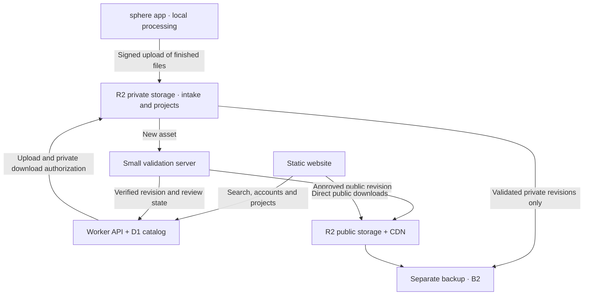

# sphere: an inexpensive public library and paid private projects

Proposal and pricing research · 7 September 2026 · USD unless stated otherwise.

**Current scope:** [CATALOG-MVP.md](CATALOG-MVP.md) now defines the product and delivery order: public HDRI browsing/downloads, Blender/Unity/Unreal imports, then a separate tracked-placement experiment. Its optional workflow-tool model replaces the private project-pass recommendation below. Retain this earlier proposal for infrastructure/cost reference; its pricing and private-project features are historical alternatives, not the launch plan.

This is a design, not a deployed service or an adopted price/license. It supersedes the launch sequence in [the earlier platform roadmap](PLATFORM-ROADMAP.md): a useful public collection can launch before RAW capture, 16K output or a calibrated acquisition workflow. Those remain optional quality improvements. The Android app remains local and account-free in the current release.

## Product and business recommendation

Build a broad library of real lighting situations, with free public browsing and downloads. Start with ordinary places and conditions that people struggle to find: small kitchens, stairwells, garages, mixed fluorescent interiors, street corners after rain, and the same location in different light. Useful variety and fast comparison are the reasons to visit.

Fund the public collection with **optional private project spaces**. Proposed starting offer: **$5 for one project for 30 days, 20 GB of finished captures, with collaborators included**. Pay for a shoot when needed; renewal is optional and automatic renewal is off by default. These are proposed prices to test with users, not validated demand.

The open-source app captures, processes, inspects and exports without payment. Public files have the same download quality for everyone. The paid workflow adds shared private captures, scene/take notes, saved light orientation/exposure, comparisons and a stable revision for handoff. A private project should save a real production task beyond what an ordinary shared folder already does.

## Start smaller than the eventual architecture

**First release: a static website, object storage and 100–300 permission-cleared assets.** Publish a small catalog JSON during deployment, search/filter it in the browser, and link directly to finished files. Run the existing local tooling plus a small validator before an operator publishes each asset. Use a separate backup of the approved masters and catalog.

This needs no accounts, payment integration, database or continuously running server. Budget **$2–5/month** for a domain allowance, storage and modest request volume, using the free static-hosting allowance. Review time is extra. Static hosting can stay on Cloudflare Workers Static Assets; its static requests are free. [Static asset billing](https://developers.cloudflare.com/workers/static-assets/billing-and-limitations/).

Use an optional supporter payment link to test willingness to contribute. Avoid building subscription administration before people use the collection. Source files and location imagery do not belong in the public code repository.

## Architecture when contributors and private projects arrive

We own the domain, cloud accounts, service code, database and asset collection. We rent the machines and storage. Keep the server deployment in a separate repository; the app's file format and client protocol should remain documented.

The arrows describe data flow, not public access to the private bucket. The app obtains upload authorization from the API. The validator also commits validated private revisions back to private storage. Publication requires contributor consent and the applicable review step; successful decoding alone does not publish a file.

| Component | Initial choice | Purpose and cost control |
|---|---|---|
| Website | Static TypeScript site on Workers Static Assets | Small generated asset pages, cached thumbnails, client-side sphere viewer; no server render for every visit |
| API and catalog | One Worker plus D1 | Accounts, permissions, searchable metadata, upload reservations and a jobs table |
| Search | Indexed facets and SQLite FTS5 | Title, place type and lighting tags; add another search service only when actual searches justify it |
| File storage | R2 Standard, separate public/private buckets | Immutable finished assets; download bytes bypass the application server |
| Validation | One $6/month DigitalOcean Basic VM | Native EXR/HDR decoding, size checks and derivatives, one bounded job at a time; move to $12/2 GiB if measured memory requires it |
| Backup | B2 plus catalog exports | Separate-provider recovery for masters and metadata; previews are reproducible |
| Payments | Hosted Stripe Checkout, added with private projects | One-off project passes; verified, idempotent webhooks grant service time |

D1 supports [FTS5](https://developers.cloudflare.com/d1/sql-api/sql-statements/). The VM prices correspond to [DigitalOcean's 1 GiB and 2 GiB Basic plans](https://www.digitalocean.com/pricing/droplets), not a measured throughput guarantee. Start with 2K/4K, single-part RGB files and streaming/bounded decoders. Do not accept arbitrarily large or deep/multipart EXRs into a 1 GiB worker.

### Browse and download experience

- Open the site and immediately browse without signing in. Filter by indoor/outdoor, light type, time/weather where supplied, resolution, and intended use: lighting, reflections or visible background.
- Use the transparent chrome sphere as the catalog image. Load small JPEGs first. Fetch a small HDR environment only when the interactive comparison opens; render the chrome/18% grey scene in the browser.
- Offer a shared exposure/orientation control across selected assets. Show whether radiance is relative or calibrated; auto-normalization must be a visible viewing choice.
- Asset pages show a panorama, perspective inspection, ground treatment, known limitations, creator, license and **EXR/HDR buttons with exact dimensions and bytes**. Save an asset/revision reference with a project so later edits do not silently change a shot's environment.
- Public collections and comparison links can be shared freely. A private share uses project permissions or an explicitly created revocable guest link. Free viewers do not count as paid seats.

Public files use a custom R2 domain and immutable cache keys. Configure cache rules for HDR/EXR explicitly; `r2.dev` is a development endpoint, and custom-domain caching is the production path. [R2 public buckets](https://developers.cloudflare.com/r2/buckets/public-buckets/). Private transfers use short-lived signed S3 endpoint URLs: these signatures do **not** work on custom domains. [R2 presigned URLs](https://developers.cloudflare.com/r2/api/s3/presigned-urls/).

### Upload and publication

The user sees **select → upload → validate → review → publish**, with bytes, progress and retry status. For a private project, the last step is “ready in project.” No background publication of existing captures.

1. The app prepares one master, a manifest and lightweight previews. Default to finished captures; uploading source brackets is outside the first service. Show the final size before sending.
2. The API verifies the account, reserves quota, and issues a short-lived upload ticket for unique keys. Apply byte, dimension, format and pending-upload limits. Where supported, bind signed requests to the expected length; verify the actual object and clean up oversize or abandoned uploads regardless. A signed URL by itself is not a storage budget.
3. Upload directly to private intake storage. Finalization checks length/hash and schedules an idempotent job. The VM leases jobs through the API, with timeouts and bounded retries; there is no need for a separate queue product at this volume.
4. In an isolated process, decode and check the file, strip unneeded metadata, verify the preview against the master and create the distribution derivatives. Keep credentials out of the decoder process. Treat the client manifest as untrusted, including any claimed quality score.
5. Keep validated private revisions private. For a public contribution, show the deliverables and license consent, then complete review. Copy only an approved immutable revision into public storage. Clean up intake objects on success or expiry.

Store one lossless EXR master plus one useful HDR download derivative and small previews. A 2K HDR derivative gives broad compatibility without keeping every format at every resolution. Preserve the native-resolution EXR; label derivative resolution plainly. Additional variants can come later, generated once and cached. Public downloads must never start an unrestricted conversion job. The cost model below includes the retained derivative bytes.

Back up validated masters, rights/revision records and catalog exports nightly, with a short rolling retention for deleted records; test a restore. Private deletion must include derivative and backup expiry. The initial recovery target is up to 24 hours of data loss and restoration within a working day, to be tested before private-project launch. This is not a high-availability SLA.

## A wider collection with honest quality information

Accept useful handheld 2K/4K captures. A filled ground patch, a modest seam or a light source of uncertain intensity need not exclude an environment that helps someone light a scene. Let the user inspect and filter those properties. Keep corrupt files, plainly unusable panoramas, deceptive claims, duplicates and unauthorized uploads out.

| Displayed property | How to establish it |
|---|---|
| Resolution and file size | Server measurement |
| Capture type: bracketed JPEG / RAW / unknown | App provenance or contributor declaration, with its source shown |
| Relative radiance / calibrated | Relative by default; calibration requires evidence and review |
| Ground captured / filled / unknown | Manifest plus edited-region mask where available; otherwise declaration |
| Visible seams, moving objects, clipped or uncertain lights | Diagnostics and/or review; distinguish measured, reported and unknown |
| Suitable for a visible background | Reviewed recommendation, separate from usefulness as a lighting reference |

Do not turn an HDR file extension into an accuracy badge. Existing finished masters may no longer contain the source data required to prove whether a bright source clipped. “Unknown” must stay unknown. Keep RAW and chart calibration as a separately developed capture option, without holding the public library launch hostage to it.

For breadth, invite contributors to fill specific search gaps and group related captures by place/lighting variation. Reward useful contributions with visibility and credit, not cash or storage for every upload. Start by reviewing a contributor's first few submissions, then use trusted publishing plus sampling and reports. Trust affects review workload, not whether a file is radiometrically verified.

Proposed public licensing is **CC0 with explicit contributor agreement**, so users can download and use an asset without tracking paid entitlements. CC0 cannot simply be revoked after distribution and does not settle every third-party right; explain that at publication. Private assets retain their owner's rights. [CC0 terms and limitations](https://creativecommons.org/publicdomain/zero/1.0/). This proposal applies no license to existing captures.

## Monthly infrastructure model

Prices checked 7 September 2026. These are planning estimates, not a load test or provider quote. Use decimal GB/TB for the model; real billing units and rounding can differ slightly.

Assume an average **25 MB retained per public asset**, including master, HDR derivative and previews, plus one equally sized backup as a conservative allowance. This is a budget assumption to measure during the pilot, not a promised compression ratio. No exposure stacks, duplicate revisions or unlimited derivatives are included.

| Monthly workload or cost | Small catalog | Established catalog | Large catalog |
|---|---:|---:|---:|
| Public assets | 1,000 | 10,000 | 100,000 |
| Primary storage | 25 GB | 250 GB | 2,500 GB |
| Full-file downloads | 10,000 | 100,000 | 1,000,000 |
| Download traffic at 25 MB | 0.25 TB | 2.5 TB | 25 TB |
| R2 primary storage, after 10 GB allowance | $0.23 | $3.60 | $37.35 |
| Separate B2 copy, ignoring its free allowance | $0.17 | $1.74 | $17.38 |
| Workers Paid, including the modeled D1 usage | $5 | $5 | $5 |
| One validation VM | $6 | $6 | $6 |
| Domain allowance, amortized | $2 | $2 | $2 |
| **Modeled subtotal** | **$13.40** | **$18.34** | **$67.73** |
| **Suggested operating budget** | **$20–30** | **$25–45** | **$85–120** |

The operating range leaves room for modest email/logging, temporary intake/backup history, request overages and a VM resize. It excludes development, review/support labor, payments, tax and private-project storage. It is not a spend cap. The static, operator-published pilot described earlier omits the $5 API plan and $6 VM, giving its separate $2–5 estimate.

The relevant published rates are R2 Standard $0.015/GB-month, no internet egress charge, and monthly free allowances of 10 GB, 1 million writes/Class A and 10 million reads/Class B. Overage is $4.50/million A and $0.36/million B, rounded to billing units. [R2 pricing](https://developers.cloudflare.com/r2/pricing/). B2 starts at $6.95/TB-month; we budget a full duplicate without its free allowance. [B2 pricing](https://www.backblaze.com/cloud-storage/pricing/).

Workers Paid starts at $5/month, with 10 million dynamic requests and 30 million CPU milliseconds included. [Workers pricing](https://developers.cloudflare.com/workers/platform/pricing/). D1's paid allowance includes 5 GB, 25 billion rows read and 50 million rows written monthly; indexes matter because scanned rows count. [D1 pricing](https://developers.cloudflare.com/d1/platform/pricing/).

Traffic assumptions behind the included allowances: as many browse visits as downloads, 40 thumbnail requests per visit, 90% thumbnail CDN hits, four API calls per visit averaging at most 5 ms CPU, and at most one origin GET per download. At the largest modeled workload, that is about 5 million origin object reads and 4 million API calls / 20 million CPU ms, before smaller validation and administrative work. Budget fewer than 1 million Class A operations and 5 GB of indexed catalog data. Validate these assumptions with actual access patterns; range requests, retries and bot traffic can raise request counts.

Reproduce the main storage calculation with `S = asset_count × 0.025` GB, `R2 = max(S - 10, 0) × 0.015`, and `backup = S × 0.00695`. Subtotal is those costs plus $13. Display rounded values; the provider rounds billable usage. At **100 MB per asset**, 100,000 assets instead give about **$232.35/month before operating headroom**. At 50 million origin Class B reads, the request overage alone is another **$14.40**. Free egress does not make every operation free.

A more important cost is human time: `new submissions × minutes reviewed`. One thousand new submissions at one minute each require **16.7 hours**, before support and reports. At an illustrative $30/hour labor allowance, that is $500. Catalog size alone does not determine new-upload volume or review work. Queue latency, reviewer time and repeat usefulness should determine when we expand contributor access.

### Keep the bill predictable

Keep all services under our accounts with billing alerts, measured byte reservations, rate limits, job CPU/time limits and automatic intake cleanup. Start with a 128 MB total finished-asset limit and a small new-contributor pending queue; refine against actual files. Give users the size before upload. Never silently add a paid overage.

Use cursor pagination, indexed search, cacheable public responses and aggregate download analytics instead of a database write for every download. Cap log retention. Public downloads should continue if the validator fails; pause new work when the processing queue or storage budget is exhausted. Provider alerts and per-request CPU limits are not global hard caps against every possible bill.

Avoid a paid search cluster, a GPU service, server stitching, Kubernetes, analytics event pipelines or a separate database server in the first version. Cloudflare-native containers are a future alternative to VM maintenance, but compare total compute, memory and orchestration charges after measuring the jobs. The VM's transfer allowance also needs monitoring if backups and validation traffic grow; public downloads do not pass through it.

## Pricing to test, with the actual tradeoffs

| Offer | Proposed price | User gets |
|---|---|---|
| App and public library | Free | Local capture/export, public downloads, comparisons and public collections |
| Private project pass | $5 / 30 days / project | 20 GB of finished assets, shared views/notes and revisions, collaborators included |
| Optional library supporter | $24 / year | Supports the collection; optional credit, without gating file quality or ordinary downloads |

Only build the project offer once its workflow is useful. Offer supporter payments first without inventing a membership feature matrix. Do not promise unlimited permanent hosting. At pass expiry, a project becomes read/download-only for **90 days**, with the expiry date and export reminders visible, then cloud data is removed unless renewed. Local and downloaded files continue to work. A private project never becomes public because payment stops. Document a bounded backup-purge period too.

Using Stripe's US domestic-card price of 2.9% + $0.30, a $5 one-off payment leaves **$4.555** before other costs. Twenty fully occupied GB cost about **$0.439/month** for R2 plus a B2 copy at marginal rates. Even if the user never renews and uses the full 90-day grace, four months of that storage cost **$1.756**, leaving about **$2.80** for shared infrastructure and operations before tax, support, requests, payment disputes and backup deletion lag. [Stripe pricing](https://stripe.com/pricing/).

A $24 yearly supporter payment leaves approximately $23.00, or $1.92/month when spread over a year. Roughly 16 supporters cover a $30 infrastructure budget; around 63 cover $120. These figures do not fund an engineering team or substantial moderation. For example, 100 project passes per month leave about $280 after card fees and the conservative four-month storage reserve, before shared costs and labor. The service needs retention or meaningful volume to become a business.

The unusual part is pricing the shared production workspace as a project expense, with privacy and collaboration included, while the public collection gets more useful for everyone. Do not charge viewers by seat, meter individual public downloads, require uploads to unlock files, or turn contributions into a points currency. Those choices create friction or reward volume over usefulness. Larger storage and annual arrangements can be negotiated during the pilot; do not launch six confusing tiers.

Test the core assumption with 10 small film/VFX/game teams: can they use a private project for one real handoff, and will they voluntarily pay $5 for the next one? Track that alongside free-library return visits and successful downloads. If nobody pays, keep the low-cost public collection and change the paid workflow before scaling it. Cheap infrastructure does not establish product demand.

## Open-source and portability commitments

The app repository currently has no root license file. Public visibility alone does not grant normal open-source reuse rights. Choose an explicit license for first-party app code, with Apache-2.0 as a reasonable candidate, after checking dependencies and notices. [GitHub's licensing guidance](https://docs.github.com/en/repositories/managing-your-repositorys-settings-and-features/customizing-your-repository/licensing-a-repository). This document does not make that legal choice on the owner's behalf.

Publish the asset manifest and client API contract. Authenticate service accounts and enforce quotas server-side; an open client must not contain a service secret. The optional sync module should be detachable from local capture. Keep masters and metadata exportable, use standard HDR/EXR, and provide a public catalog export with licenses/hashes. Open-source app code, asset licensing and use of the hosted API are separate commitments. Public CC0 files remain usable after download without a subscription.

The service repository can remain private while the capture app is open. The reason to use our service should be a convenient, trusted collection and project workflow. Documenting the protocol and backing up outside the primary provider also makes future migration more practical.

## Build sequence and exit criteria

1. **Public browse/download pilot.** Obtain explicit rights for 100–300 varied captures; publish static pages, local search, chrome thumbnails, clear limitations, EXR/HDR downloads and a small browser lighting viewer. Add a supporter link. Exit when users can find a suitable light and successfully use it in Blender or an engine; measure bytes, search gaps and repeat use.
2. **Contributor intake.** Add the Worker/D1 API, account login, direct private upload, manifest validation, visible processing/review, publication consent, quotas and independent backup/restore. Human-review first contributions. Exit when retries cannot duplicate/publish files, privacy checks pass, and actual storage/validation costs fit the budget.
3. **Private project pilot.** Add project permissions, revocable guest viewing, scene/take notes, exact-revision handoff, paid passes and visible retention/export. Verify access boundaries, payment replay handling and expiry/deletion behavior before taking payment. Exit when real teams reuse and pay for the workflow.
4. **Grow through useful coverage.** Add contributor requests for missing locations/light types, group variations, and improve search using observed failures. Add Blender integration and optional calibrated captures when their value is demonstrated. Increase automation or worker capacity when measured queue/review load requires it.

Keep the initial implementation focused on browse, inspect and download. The public catalog is the first product; cloud collaboration is the revenue experiment. No paid infrastructure, deployment, new app permissions or automatic uploads are introduced by this planning change.
