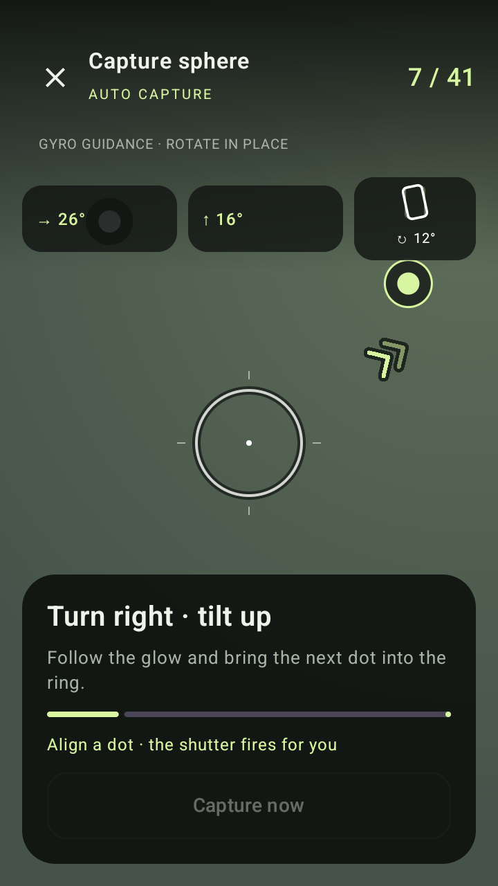
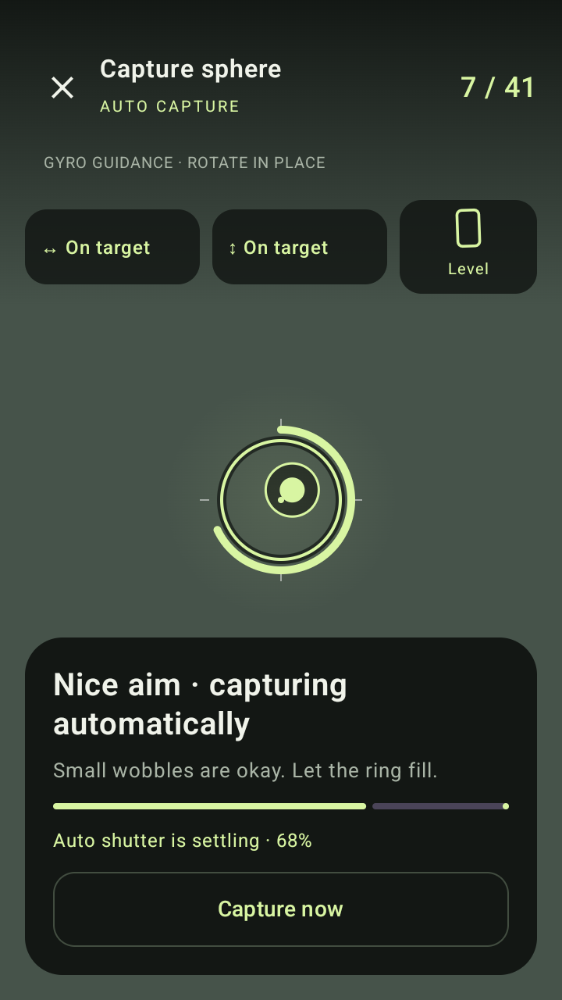
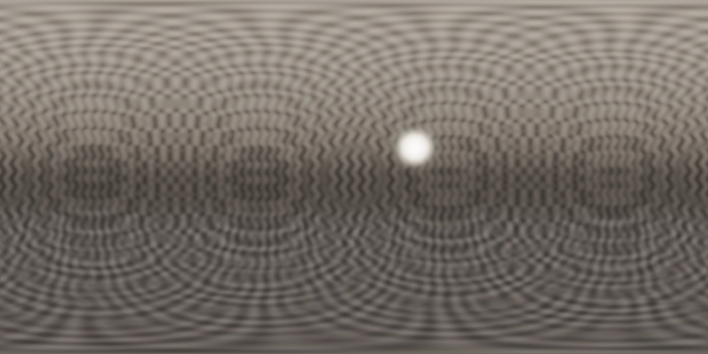

# Sky capture and fewer stops

The Pixel 8 report identified two practical failures: AR relocalization moved the estimated camera origin after viewing blank sky, and the capture plan requested 74 or more stops.

## Fixed center and inertial orientation

Capture now assumes a single physical optical center and measures **orientation only**. Android's `TYPE_GAME_ROTATION_VECTOR` combines gyroscope and accelerometer data. Gravity supplies vertical; yaw is relative to the starting view. The same sensor listener remains active through every HDR bracket and preview restart. Neither AR tracking state nor AR pose is read by guidance, the automatic shutter, or recorded orientations. There are no distance estimates, position gates or instructions to walk back to an estimated center.

ARCore remains the existing camera-preview/shared-Camera2/intrinsics provider. This avoids changing stream negotiation at the same time as tracking. Play Services for AR is still required for that camera transport. A textureless scene can have paused AR visual tracking while gyro guidance continues normally.

The sensor world is converted from Z-up to Y-up. Unrotated JPEG camera axes use the rear camera's reported sensor orientation; screen rotation is handled separately. The saved orientation is interpolated at the center-row midpoint of the middle exposure when camera and sensor clocks are comparable. A stale motion sensor pauses the shutter with visible status. The previous forgiving 450 ms dwell and exposure-window motion checks remain.

**Tradeoff:** orientation tracking cannot measure translation. Rotate around the main lens and avoid walking. Gyro yaw can gradually drift during a long capture; image overlap refinement still adjusts orientations during stitching. Sensor-to-JPEG calibration and real outdoor loop drift need Pixel 8 testing. Leaving and resuming capture still requires matching the first saved photo.

## Camera-aware coverage

The old plan used half of the smaller FOV for spacing in both directions. The replacement searches compact latitude rings using both dimensions of the rectangular image. It accounts for the stitcher's 4.5% edge crop, off-center principal point, a 6° aiming allowance, and ±10° continuous handset roll. Pole footprints permit unrestricted roll. Leveling remains optional; large roll, scene motion or drift can still require extra gap-filling photographs after stitching checks.

Coverage is checked on a one-degree sphere grid with 6.75° angular erosion: 6° for aiming plus 0.75° for the grid's maximum cell radius. Roll bounds use an analytic continuous minimum, not selected roll samples. Independent tests use the offset half-degree locations, additional roll samples, and 6° erosion. No captured image pixels or processing resolution are removed to reduce the count.

| Portrait field of view | Previous stops | New stops |
| --- | ---: | ---: |
| 54° × 68° | 74 | 41 |
| 60° × 75° | 50 | 32 |
| 84° × 100° | 37 | 20 |

These are measured planner test cases, not a claim about an unmeasured Pixel 8 camera mode. The phone reports its actual total after a visible planning step. A stop contains three or five automatic HDR exposures.

Existing unfinished projects get the new plan on entering capture. Saved photo footprints replace redundant future stops. Existing IDs, poses, file references and exposure metadata stay intact; new targets receive unused IDs. An additive `coverageVersion` records migration, and `poseSource` distinguishes legacy AR poses, inertial fixed-pivot poses and synthetic sample poses.

## Verification

Local regression checks cover sky-to-horizon return, automatic capture at the zenith, sensor freshness, signed quaternion interpolation, camera/display axes, full-sphere coverage, off-center image crops, metadata compatibility and migration without losing original photographs. The release workflow additionally installs the exact candidate APK and exercises the native HDR/stitch/export pipeline, smooth-field seam checks, recovery and production Compose HUD. [Preview 8](https://github.com/otdavies/android-hdri/releases/tag/v0.1.0-preview.8), source `7117bc0`, passed [GitHub Actions run 34014604428](https://github.com/otdavies/android-hdri/actions/runs/34014604428): build, installed-APK verification and publication. All 23 JVM tests and release lint passed; all 8 instrumentation tests passed in 22.117 seconds. The published APK is 123,691,153 bytes with SHA-256 `cb1657f6bb726197bed6da464c136d6c2673913953c8ce2d78f654619109b707`.

The native synthetic pipeline produced 100% coverage in 4.987 seconds, with median relative radiance error 0.12162 after global scaling. The independent smooth-field test measured maximum adjacent-row relative error change 0.002313, longitude difference 0.008197, and row bias 0.01317, all within the existing gates. These are emulator/synthetic measurements, not physical Pixel 8 performance or calibration results. See [machine-readable evidence](evidence/sky-capture.json).

The screenshots below show the production Compose HUD with injected pose state, not a live physical camera.

## Primary references

- [Android position sensors: game rotation vector](https://developer.android.com/develop/sensors-and-location/sensors/sensors_position#sensors-pos-gamerot): relative rotation without magnetic-field corrections, with permitted yaw drift.
- [Android sensor coordinate system](https://developer.android.com/develop/sensors-and-location/sensors/sensors_overview#sensors-coords): device axes stay in the natural orientation as the display rotates.
- [ARCore Camera reference](https://developers.google.com/ar/reference/java/com/google/ar/core/Camera): separates unrotated image intrinsics and projection from world poses; world poses are invalid when tracking is paused.
- [Camera characteristics](https://developer.android.com/reference/android/hardware/camera2/CameraCharacteristics): sensor orientation and sensor timestamp clock source.
- [Camera capture results](https://developer.android.com/reference/android/hardware/camera2/CaptureResult): exposure timestamps, exposure duration and rolling-shutter skew.

The coverage optimizer is a deterministic geometric planner implemented here, not a claimed research model. Existing stitching research and its limitations remain documented in [RESEARCH.md](RESEARCH.md).
