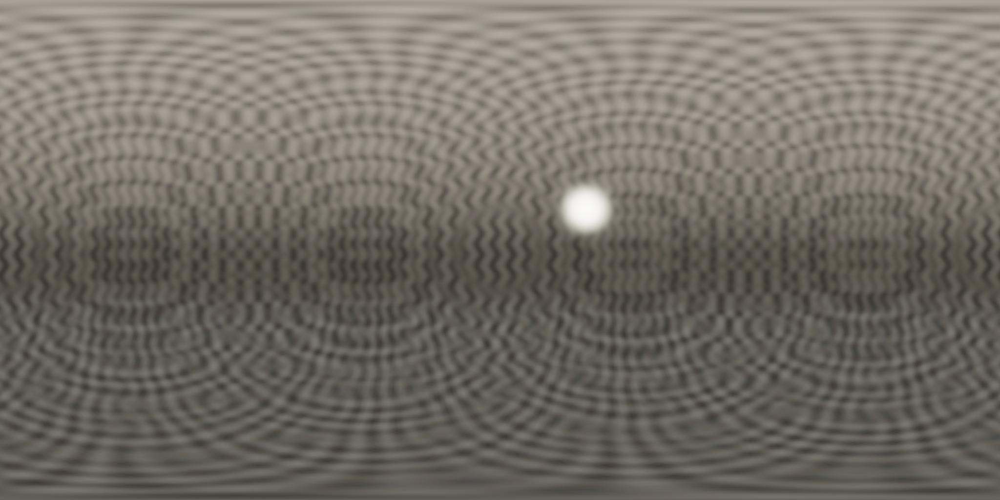

# Handheld stitching update

This update addresses the first real 41-direction, five-exposure indoor source session supplied for diagnosis. The original photos, source ZIP and room previews are private and are not committed here.

## What changed

- Contrast-enhanced RootSIFT matching, spatially distributed RANSAC inliers and a joint robust rotation/focal solve replace ORB and the old hard 7° match / 8° correction limits. Gravity remains a stronger prior than heading. Effective focal correction is bounded and requires a sufficiently connected graph; it is not a physical lens calibration claim.
- Forward/backward-checked DIS optical flow contributes local overlap detail. A regularized 9×7 inverse mesh corrects small viewpoint shifts, with displacement and fold checks. Blank regions retain their capture prior.
- Binary graph-cut label swaps route whole seams around disagreement, including longitude wrap. Float Laplacian blending retains a tile halo and extends actual source edge colors into the pyramid.
- Bracket alignment estimates subpixel translation and rotation on exposure-invariant edges. It checks confidence and motion bounds before replacing the MTB fallback.
- Continuous RGB exposure weights reject saturation coherently across channels. Treating unsaturated blue as valid after red had clipped produced false color rings in the supplied scene. Shared, monotonic response estimation follows the identical requested tone curves; the low-end response tends to zero. These JPEG-derived radiance values remain approximate.
- Native OpenCV kernels evaluate the radiance merge. Float32 checkpoints avoid repeated RGBE quantization, a render-scoped LRU bounds decoded images to approximately 192 MiB, and progress writes are limited to four per second. Preview tone conversion uses a lookup table; HDR values are unaffected.
- Each new bracket freezes the preview's focus distance instead of jumping to infinity. Completed projects offer **Rebuild from saved photos**. Processing reports include stage timings, registration residuals, local support and source-load counts.

## Measurements and limits

The same production Kotlin processing sources were replayed on a Linux host, with OpenPnP's OpenCV 4.9.0 native bundle and small Android file/bitmap adapters. The Android APK uses OpenCV 4.12.0 and is separately tested by CI. Host JPEG encoding and memory reporting differ from Android; these measurements are **not Pixel 8 timings**.

| Measurement | Preview 8 baseline | Updated engine |
|---|---:|---:|
| Directions without reliable visual matches | 19 / 41 | 5 / 41 |
| Complete fresh host processing | 58.07 s | 49.14 s |
| Spherical render, including preview save | 27.59 s | 10.73 s |
| New accepted overlap pairs / feature matches | — | 73 / 5,029 |
| New median angular residual before / after solving | — | 6.35° / 0.62° |
| Additional consistent local flow correspondences | — | 618 |
| Source directions receiving a bounded local mesh | — | 36 |

The updated fresh replay is approximately 15% faster overall and its rendering stage approximately 2.6× faster. Extra computation is deliberately spent on stronger registration. These are individual controlled replays, not a distribution of device benchmarks. The user's exported old report recorded 98.16 seconds of pipeline time; the reported five-minute experience may include capture, thermal waiting or other time outside that report. The new stage timings make future comparisons more specific.

Visual inspection of the private replay confirms substantially better room alignment and removal of the large false color rings and purple patches. Some curtain joins, very near objects and the captured photographer remain imperfect. A single rotating-camera model cannot fully undo translation, occlusion, moving content or clipped JPEG information. No generative fill is used. Source captures are retained for further improvements.

## Reproduce privately

Requires Python 3, JDK 17, about 3 GiB host RAM and Maven Central access on the first run. The helper downloads pinned host dependencies and compiles the real processing/core sources. Keep the working directories outside this public checkout:

```sh
python3 scripts/replay.py /private/capture.zip --work-dir /private/replay-current
python3 scripts/replay.py /private/capture.zip --work-dir /private/replay-before --ref 907b07d48877ca4c510eed919d68459cf50b9019
```

Use a new work directory for fresh timing; subsequent runs reuse HDR checkpoints. The helper writes the HDR, JPEG and report inside the private working directory and never uploads them. Its bitmap adapter uses host JPEG encoding and its atomic-file adapter is test-only; neither ships in the Android application.

## Verification

The release gate requires 24 JVM tests, Android lint and 12 tests against the exact signed APK installed twice on the API 36 emulator. New regression coverage exercises genuine feature detection under pose drift and small viewpoint offsets, subpixel bracket rotation, continuous HDR color gradients, graph-cut seams, native/scalar merge agreement and lossless high-range float checkpoints. The existing full-sphere radiometry, row/longitude continuity, cancellation/resume, metadata and UI gates remain.

### Published Preview 9

[Download the signed APK](https://github.com/otdavies/android-hdri/releases/download/v0.1.0-preview.9/hdri-0.1.0-preview.apk). Install it over Preview 8, open the existing project, and choose **Rebuild from saved photos**.

[Actions run 34023263263](https://github.com/otdavies/android-hdri/actions/runs/34023263263) built source `570e89114f20cc0ee03083ac75e0f2e2ad9fb8fd`. All 24 JVM tests, lint and 12 installed-APK tests passed; the device suite took 40.337 seconds. The same APK was installed twice, tested and published without rebuilding. The published asset's SHA-256 is `cbd3b3460126b3d9da1b354f6b720c854e83e5a3e90424f48f3ad68c8247d480` (123,740,305 bytes).

The retrieved, checksum-verified device evidence records 100% synthetic sphere coverage, 8.32% median relative radiance error after one global scale fit, and 10.015 seconds of synthetic pipeline processing. Smooth-field checks measured a maximum adjacent-row error change of 0.00231 and longitude difference of 0.010, within the existing limits. This synthetic case takes longer than Preview 8 because it also runs the stronger geometry/seam stages; the real-source speed comparison above is separate.

Machine-readable evidence: [release](evidence/stitching-release.json), [synthetic pipeline](evidence/stitching-pipeline.json), [row/longitude continuity](evidence/stitching-continuity.json).



The published private replay helper was also executed successfully against the supplied ZIP. Synthetic fixtures and host replay do not replace physical Pixel 8 runtime, thermal and camera calibration checks.
