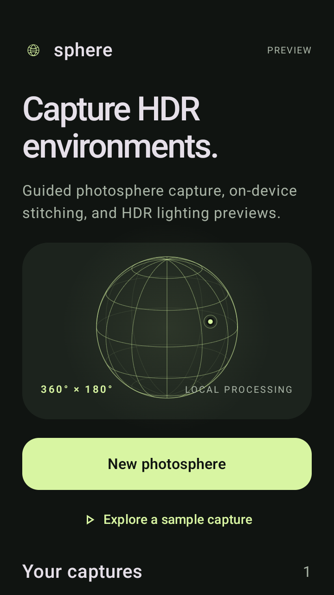
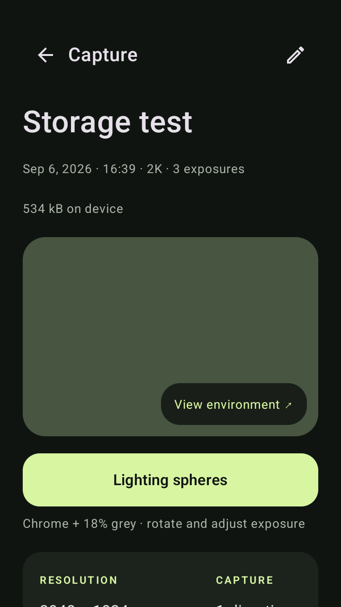
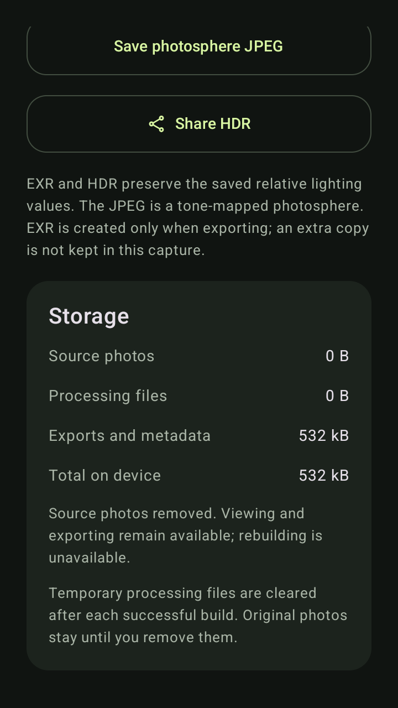

# Capture storage and OpenEXR export

sphere uses the original green/ink palette and globe mark within the circular adaptive/themed icon. Interface labels describe actions directly. Completed captures have a prominent **Lighting spheres** button with **Chrome + 18% grey** directly under the preview.

## Storage controls

Each capture row and detail screen reports its on-device size. **Storage** separates original photos, processing files, and exports/metadata. The home screen also shows aggregate capture storage. Sizes are measured off the UI thread; active processing measurements are throttled to three seconds. These are file-content sizes, excluding the APK, filesystem overhead and documents saved to other locations.

A successful build commits the final HDR, JPEG and manifest, then clears its regenerable `processed/` float images and alignment previews. A visible cleanup stage precedes completion. Paused and failed builds retain checkpoints so resume can reuse them. **Clear processing files** reclaims old builds' intermediates; on a paused build, the next resume recomputes them from originals.

**Remove source photos** is an explicit, confirmed action for completed captures. It also clears any remaining processing files. The confirmation shows the reclaimable amount and explains that rebuilding will be unavailable. Export the original capture ZIP first if you need an archive. Finished HDR/JPEG, lighting inspection and all final export formats remain available afterward.

Removal intent is saved atomically before deleting the first source. Interrupted removal stays marked as incomplete source data and offers **Remove remaining source photos**. Original-bundle export and rebuild are blocked once removal starts. Repeated cleanup is safe. Capture metadata and direction counts remain intact. A per-capture file-operation lease prevents cleanup/deletion from racing processing or exports; malformed filenames cannot target outputs or files outside the capture.

The policy follows [Android's app-specific storage guidance](https://developer.android.com/training/data-storage/app-specific): the application manages disposable files explicitly. Resume checkpoints are retained in persistent app storage until a successful finish, rather than relying on an OS-evictable cache during processing.

## OpenEXR

**Save OpenEXR (.exr)** exports a single-part scanline environment with three 32-bit FLOAT channels, lossless ZIP compression, Rec.709/D65 chromaticities, and latitude-longitude environment metadata. It preserves the exact decoded radiance values of the saved Radiance HDR. Exposure, rotation and tone-mapping choices in the viewer are not baked into either HDR format. This is relative reconstructed radiance, not calibrated photometry or an ACES conversion.

Export uses a bounded 16-row encoding buffer plus the native decoded HDR, with visible preparation and file-copy progress. A temporary EXR is deleted after completion, error or cancellation; it is not retained inside the capture. Abandoned EXR temporary files older than a day are reclaimed when another EXR export begins. Preparing a 4K EXR requires at least 110 MB of free temporary space; its final saved size varies with image content.

The implementation follows the [OpenEXR file layout](https://openexr.com/en/latest/OpenEXRFileLayout.html) and [standard attributes](https://openexr.com/en/latest/StandardAttributes.html). Android does not depend on an optional OpenCV EXR codec. CI reads files produced by the installed APK using the independent OpenEXR 3.3.3 reference library, checking exact float channels, ZIP and raw-block fallback, scanline orientation, partial final blocks, and values beyond half-float range.

## Private-capture measurements

A fresh host replay of the supplied 41-direction / 205-photo capture completed in 49.37 seconds. This is a host measurement, not a Pixel 8 timing claim. Source images and rendered room data are not included in this public repository.

| Contents | Bytes | Approximate size |
| --- | ---: | ---: |
| Original source photos | 89,600,147 | 89.6 MB |
| Regenerable processing files retained by the prior replay | 412,754,558 | 412.8 MB |
| Total prior replay storage | 536,680,532 | 536.7 MB |
| Completed capture after automatic cleanup | 123,926,117 | 123.9 MB |
| Finished exports and metadata, without sources | 34,325,967 | 34.3 MB |
| Exported OpenEXR, saved separately | 17,023,992 | 17.0 MB |

The rebuilt JPEG is byte-identical to the prior replay. Both Radiance files decode to identical float pixels; their header branding differs. The reference OpenEXR decoder also recovers every pixel of the 4096 × 2048 HDR exactly. Savings vary with capture quality, subject detail and photo sizes. Peak working storage is still needed while stitching; cleanup reduces retained storage without lowering source or output quality.

## Verified Preview 14

[Install sphere Preview 14](https://github.com/otdavies/android-hdri/releases/download/v0.1.0-preview.14/sphere-0.1.0-preview.apk).
[Actions run 34045902894](https://github.com/otdavies/android-hdri/actions/runs/34045902894) passed 28 JVM tests, Android lint and all 22 installed-APK tests in 50.247 seconds, followed by independent OpenEXR decoding. The exact signed candidate was installed twice and published without rebuilding. Its SHA-256 is `3e316d7444d0d86882a1a9ebd43e7c87d7069eae228779dae20086dc187173b1` (123,840,249 bytes).

The first candidate was withheld when the new cleanup UI test exposed a dialog redraw race after a fast operation completed. The corrected UI captures immutable state for dialog content; the regression test remains in the release gate. Storage tests cover preserved outputs, interrupted deletion and retry, malformed filenames, missing outputs, concurrent file operations, paused checkpoints and older manifests. Lighting pixel checks still match the expected 90 / 109 / 123 gradient values exactly.

[Release evidence](evidence/storage-release.json) and [reference EXR decoder results](evidence/sphere-exr.json) are retained here. These screenshots show the installed APK with synthetic fixtures, not the user's private room capture.

