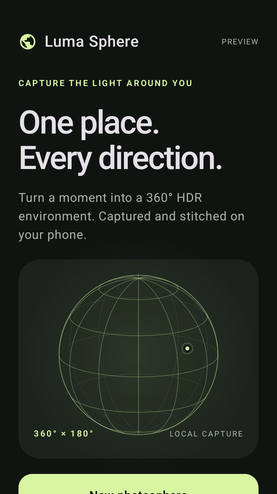
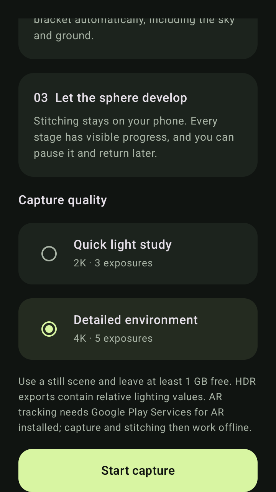
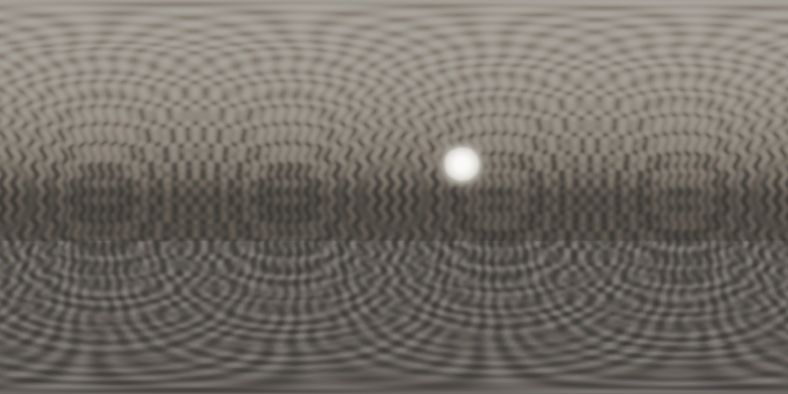

# Validation record · 0.1.0

The latest [handheld capture update](CAPTURE-UPDATE.md#verified-release) adds forgiving automatic capture, directional guidance, and a continuous sample light field. Preview 7 passed 16 JVM tests and 8 installed-APK tests; its screenshots, renderer continuity measurements and APK link are recorded there. The original preview baseline below is retained for reference.

## Local build

Passed with JDK 17, Android SDK 35 and the copied Gradle 8.11.1 / AGP 8.9.2 / Kotlin 2.0.21 toolchain:

```text
testReleaseUnitTest lintRelease assembleRelease assembleReleaseAndroidTest
BUILD SUCCESSFUL
```

Nine JVM tests passed: physical camera axes, spherical wrap/poles, dense-grid coverage for four lens fields of view, steady capture gating, hardware bracket limits, high-range radiance reconstruction, RGBE encoding/channel order, precise manifest round trips and schema rejection.

Android lint has no errors. Both the signed local application APK and separate release instrumentation APK assemble. ARCore and OpenCV arm64 native ELF load segments were inspected and use 16,384-byte alignment. This validates the libraries' alignment, not real hardware behavior.

Kotlin sources were formatted with ktfmt's Kotlin language style. Workflow YAML, shell syntax and the copied candidate-source Python script were checked locally.

## Installed-APK verification

The GitHub Actions release gate runs six tests on an API 36 x86_64 AOSP emulator:

1. Decode a generated RGBE file with native OpenCV and check HDR values/channel order.
2. Reconstruct and stitch a complete analytic light stage; verify dimensions, coverage, finite radiance, median relative radiometric error and GPano metadata.
3. Cancel processing; check originals/checkpoints remain and no final panorama is published. Resume, verify the first checkpoint is reused, and confirm a deliberately clipped bracket retains its quality warning.
4. Reopen a persisted capture with exact exposure timestamps and orientation.
5. Launch the home screen without camera permission and verify capture/sample access.
6. Navigate setup and quality controls, recording screenshots.

All six tests passed in [Actions run 34006283845](https://github.com/otdavies/android-hdri/actions/runs/34006283845), using source commit `a930ea4`. The signed APK was installed twice successfully, then tested and published without rebuilding as [v0.1.0-preview.4](https://github.com/otdavies/android-hdri/releases/tag/v0.1.0-preview.4). Candidate APKs, checksums and device reports are retained by the workflow. Publication is gated on successful installed-APK verification.

Published APK SHA-256: `05b7114e65e451c36aa7cae0a3269fda427e1e192165035f906cd32090d67912`.

The analytic sample produced a 2048 × 1024 HDR panorama from 22 directions, each with three 320 × 240 source exposures. Its measured results were:

| Measurement | Result |
| --- | --- |
| Coverage on the 512 × 256 seam grid | 100% |
| Median relative green-channel radiance error, after fitting one global exposure scale | 11.85% |
| Pipeline runtime in this emulator, excluding sample generation | 10.587 seconds |
| Complete installed-APK test suite, including resume | 6 passed in 33.327 seconds |

The final run's [machine-readable measurements](evidence/pipeline.json) are retained here with the screenshots. GitHub's release asset digest matches the published checksum; the device-verification ZIP was also downloaded and SHA-256 checked before reading its evidence.

These are synthetic fixture measurements, not Pixel 8 camera accuracy or speed claims. The projected texture and bright source were visually inspected in the exported preview. Setup screenshots confirmed legible, scrollable quality controls. Inspection also caught low-contrast Android status icons and a screenshot captured before the home screen had drawn; the follow-up UI fix sets explicit dark system-bar styling and captures the rendered Compose root.

The first device run correctly blocked publication because OpenCV's Java batch `AlignMTB.process` binding did not populate its output list. Explicit `calculateShift` and `shiftMat` calls with owned output Mats fixed that failure; the same six-test gate then passed.

## Rendered evidence

These app screenshots and the synthetic output match the evidence retrieved from the passing [final verification run](https://github.com/otdavies/android-hdri/actions/runs/34006283845), commit `a930ea4`, byte for byte. Screenshots capture the Compose root after rendering. Both pages scroll; the quality screenshot shows the bottom of setup. There are no generated mockups here.

 

The following is the actual tone-mapped export of the analytic test scene. Its procedural texture and bright source provide known input radiance; it is not a real camera capture. The full-resolution HDR is decoded and compared numerically by the instrumentation test.



## Not yet validated

No physical Pixel 8 was connected to this development environment. Real shared-camera configuration, camera/AR intrinsics correspondence, bracketing behavior, tracking stability, scene-dependent stitching quality, thermal behavior and phone performance remain pending. The synthetic test uses small source images and cannot establish real 4K capture performance or production radiometric accuracy. See `PIXEL8-VALIDATION.md`.
